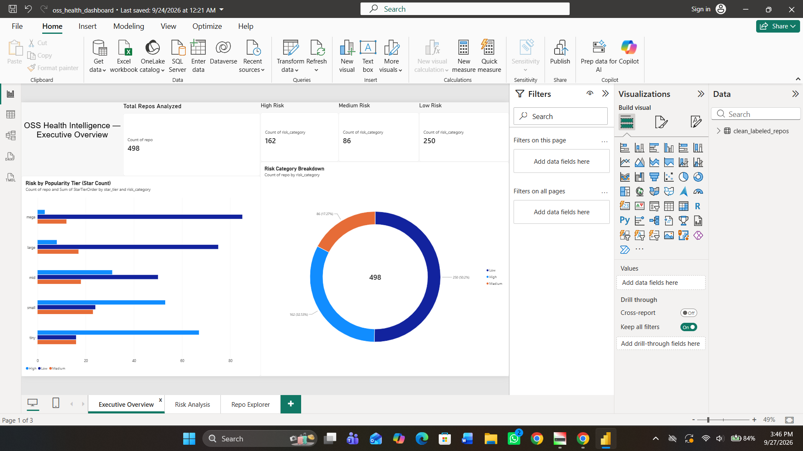
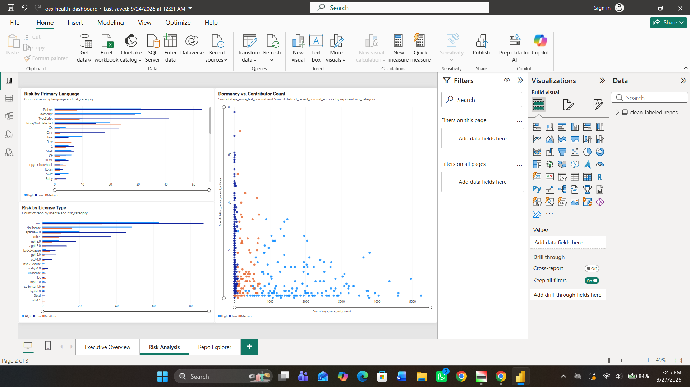
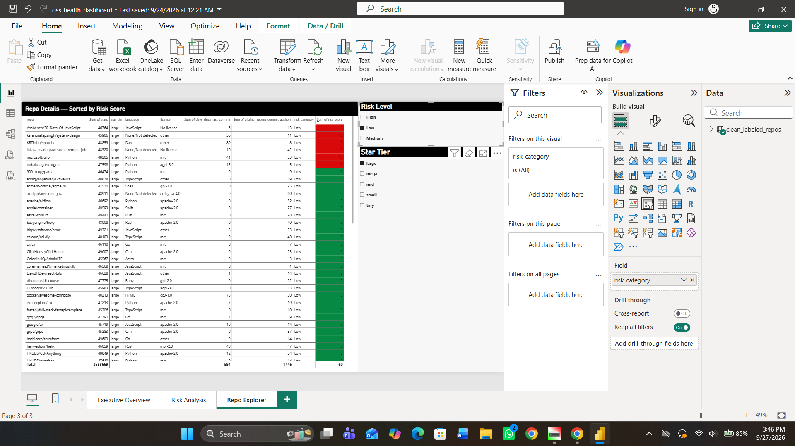
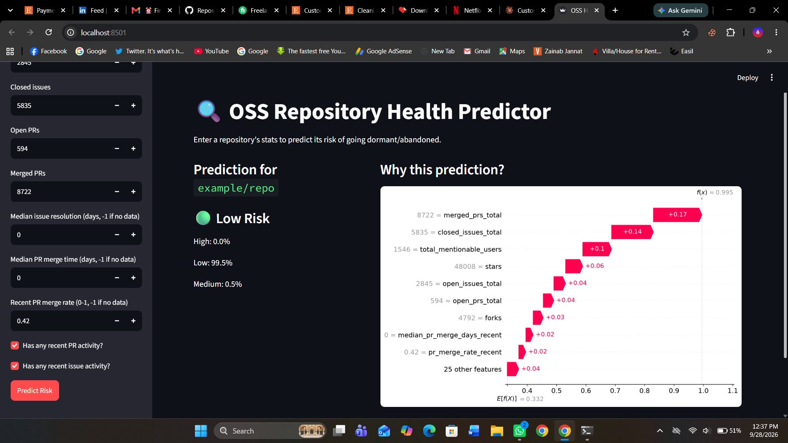

# OSS Health Intelligence

**Predicting which open-source repositories are at risk of going dormant, and explaining why.**

`Python` `GitHub GraphQL API` `SQL (SQLite)` `pandas` `scikit-learn` `SHAP` `Power BI` `Streamlit`

## Overview

Stars measure how popular a repo was, not whether anyone still maintains it. This project asks:
**can we flag at-risk open-source repositories early, and explain the reasons?**

The dataset is not a downloaded CSV. I collected it myself from the GitHub GraphQL API, built a
risk label from raw activity signals (GitHub provides no such label), and then analysed it with
SQL, EDA, machine learning, SHAP explanations, a Power BI dashboard, and a Streamlit app.

## Data

- **498 repositories**, sampled evenly across five star tiers (mega >50k stars, large, mid, small, tiny),
  100 per tier. 499 were collected; one empty placeholder repo was dropped.
- Collected with a single GraphQL query per repo (commits, issues, PRs, contributors), which uses far
  less of the rate limit than several REST calls.
- The search was deliberately sorted by stars rather than "recently updated". Sorting by recency would
  have returned only active repos and made the whole dataset look healthy.

## How "risk" was defined

Only `is_archived` is real ground truth (31 repos). To catch repos that are dead but were never archived,
I built a composite 0-100 risk score from dormancy (days since last commit), recent commit velocity,
and contributor count (bus factor). Archived repos score 100 automatically.

The result: **162 High (32.5%), 86 Medium (17.3%), 250 Low (50.2%)**. It was validated by checking that every
archived repo lands in High, and by spot-checking known repos (for example `flutter` and `bevy` come out Low,
`webpack-howto` comes out High).

## Key findings

| Finding | Evidence |
|---|---|
| Popularity is a strong but imperfect signal | High-risk rate rises from 3% (mega) to 8%, 31%, 53%, and 68% (tiny) |
| Big does not mean maintained | `stable-diffusion-webui` (164k stars) and `CS-Notes` (185k stars) have had no commits in 2-3 years |
| No license is a red flag | 60% of unlicensed repos are High risk vs 27.3% of licensed ones |
| Bus factor matters | Average risk score falls from about 80 (0-1 recent contributors) to about 16 (16+) |
| Age barely matters | Correlation between repo age and risk is only +0.10 |
| Open-issue counts mislead | Low-risk repos have the *most* open issues (median 89.5 vs 6 for High), because dead projects stop attracting issues |

## Modelling

Two feature sets were compared to test whether the expensive API collection was worth it:
**cheap** (stars, forks, language, license, age) vs **full** (cheap plus PR and issue history).

| Model | Features | Accuracy | Medium-risk F1 |
|---|---|---|---|
| Logistic Regression | Cheap | 0.72 | 0.40 |
| Logistic Regression | Full | 0.71 | 0.43 |
| Random Forest | Cheap | 0.71 | 0.36 |
| Random Forest | Full | 0.71 | 0.46 |

Overall accuracy does not change between the feature sets, but the deeper data improves detection of
**Medium-risk** repos (recall 0.29 to 0.47), the ambiguous middle group that is hardest to classify.

### Data leakage caught along the way

My first "full" model scored 92% accuracy with a perfect 1.00 F1 on the Low class. That was too good to
be real. Feature importance showed three features that were direct inputs to the risk-score formula
accounted for about 45% of the model's decisions, so it was partly reconstructing my own label.
I removed them and re-ran, and the honest result is the table above.

### Explainability (SHAP)

SHAP explains each individual prediction. For example, `myqianlan/antd-admin-boilerplate` is flagged High
at 98.5% confidence (no merged PRs, one contributor, no license, 6+ years dormant), while `bevyengine/bevy`
is flagged Low at 97% (8,722 merged PRs, 1,546 contributors).

## Dashboard and app

**Power BI dashboard** (`dashboard/oss_health_dashboard.pbix`), three pages: Executive Overview,
Risk Analysis, and a filterable Repo Explorer.





**Streamlit app** (`app/app.py`): enter a repository's stats and get a risk prediction with a SHAP
explanation.



## Bugs found and fixed

- **Contributor undercount:** GitHub only attributes a commit to a user when the commit email is linked to an
  account, so some active repos showed 0 contributors and were wrongly penalised (7 of 498 repos, including a
  316k-star active project). Fixed in the scoring logic.
- **Outlier-skewed averages:** one repo with 33k open issues distorted an average, so I switched to medians.
- **Data leakage:** described above.

## Limitations

- Single snapshot in time, so this describes current state rather than forecasting the future.
- The risk label is a validated rule, not ground truth; only `is_archived` is real.
- 498 repos and a 100-repo test set (17 Medium-risk) make small differences between models noisy.
- The language-risk pattern is likely confounded by project age and type, and does not show that a language causes risk.

## Repository structure

```
notebooks/   00 collection, 01 cleaning and labelling, 02 SQL, 03 EDA,
             04 feature engineering, 05 modelling, 06 SHAP, 07 business insights
sql/         SQL queries used in the analysis
data/        collected and cleaned datasets, SQLite database
models/      trained Random Forest models
dashboard/   Power BI report
app/         Streamlit app
```

## Running it

```
pip install -r requirements.txt
cd app
streamlit run app.py
```

Re-running the collection notebook needs a free GitHub personal access token in a `GITHUB_TOKEN`
environment variable (no scopes required).